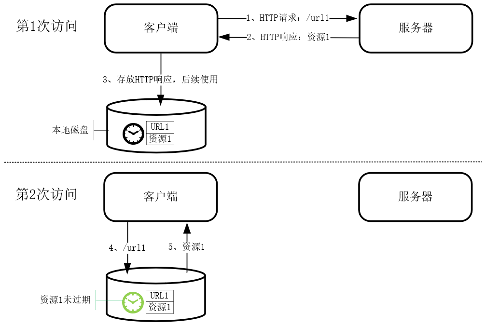
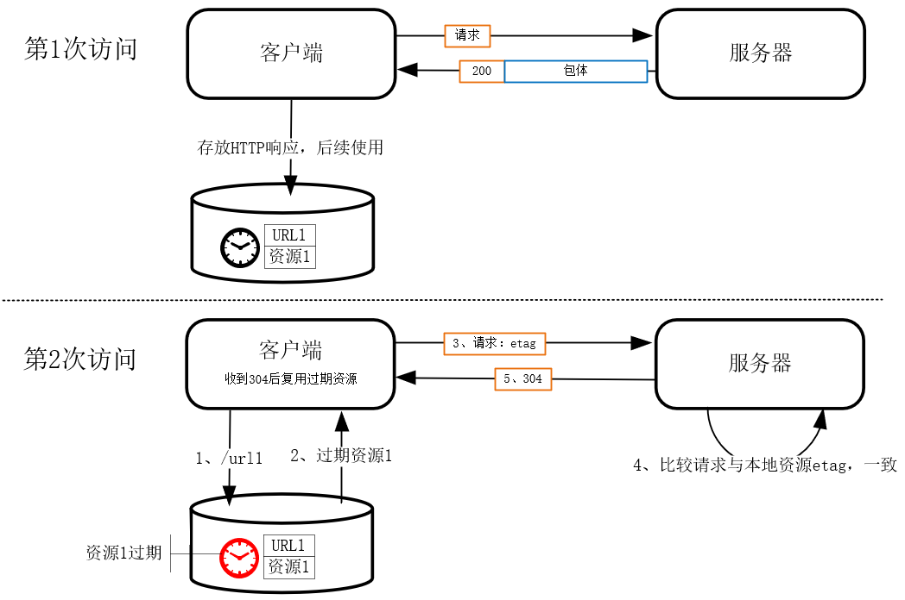
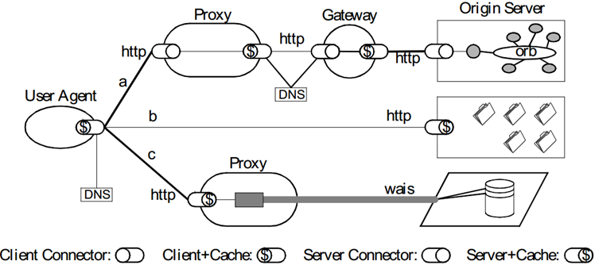
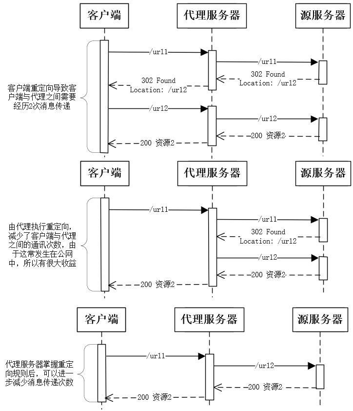
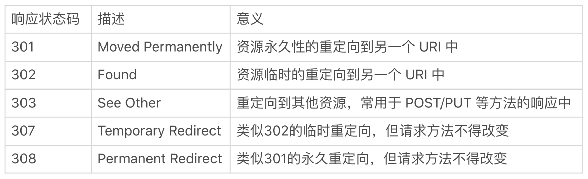
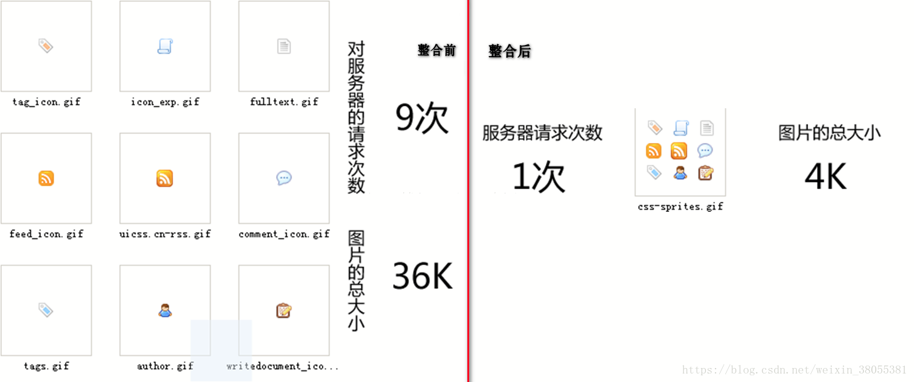
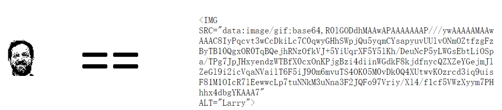
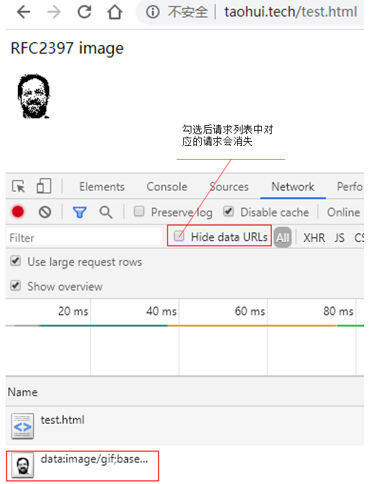
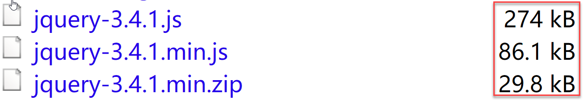
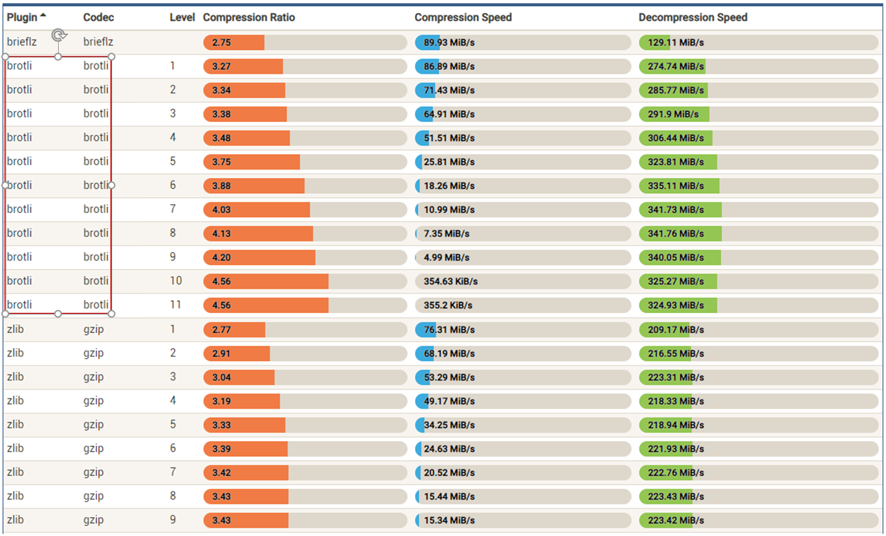

# 如何提升HTTP/1.1性能

上一讲介绍了为应用层信息安全保驾护航的 TLS/SSL 协议，这一讲我们来看看最常用的应用层协议 HTTP/1.1 该如何优化。

由于门槛低、易监控、自表达等特点，HTTP/1.1 在互联网诞生之初就成为最广泛使用的应用层协议。然而它的性能却很差，最为人诟病的是 HTTP 头部的传输占用了大量带宽。由于 HTTP 头部使用 ASCII 编码方式，这造成它往往达到几 KB，而且滥用的 Cookie 头部进一步增大了体积。与此同时，REST 架构的无状态特性还要求每个请求都得重传 HTTP 头部，这就使消息的有效信息比重难以提高。

你可能听说过诸如缓存、长连接、图片拼接、资源压缩等优化 HTTP 协议性能的方式，这些优化方案有些从底层的传输层优化入手，有些从用户使用浏览器的体验入手，有些则从服务器资源的编码入手，五花八门，导致我们没有系统化地优化思路，往往在性能提升上难尽全功。

那么，如何全面地提升 HTTP/1.1 协议的性能呢？我认为在不升级协议的情况下，有 3 种优化思路：首先是通过缓存避免发送 HTTP 请求；其次，如果不得不发起请求，那么就得思考如何才能减少请求的个数；最后则是减少服务器响应的体积。

接下来，我们就沿着这 3 个思路看看具体的优化方法。

## 通过缓存避免发送 HTTP 请求

如果不走网络就能获得 HTTP 响应，这样性能肯定最高。HTTP 协议设计之初就考虑到了这一点，缓存能够让客户端在免于发送 HTTP 请求的情况下获得服务器的资源。

缓存到底是如何做到的呢？其实很简单，它从时间维度上做文章，把第 1 份请求及其响应保存在客户端的本地磁盘上，其中请求的 URL 作为关键字（部分 HTTP 头部也会加入关键字，例如确定服务器域名的 Host 头部），而响应就是值。这样，后续发起相同的请求时，就可以先在本地磁盘上通过关键字查找，如果找到了，就直接将缓存作为服务器响应使用。读取本地磁盘耗时不过几十毫秒，这远比慢了上百倍且不稳定的网络请求快得多。



你可能会问，服务器上的资源更新后，客户端并不知道，它若再使用过期的缓存就会出错，这该如何解决？因此，服务器会在发送响应时预估一个过期时间并在响应头部中告诉客户端，而客户端一旦发现缓存过期则重新发起网络请求。HTTP 协议控制缓存过期的头部非常多，而且通常这是在服务器端设置的，我会在本专栏的第 4 部分“分布式系统优化”结合服务器操作再来介绍，这里暂时略过。

当然，过期的缓存也仍然可以提升性能，如下图所示，当客户端发现缓存过期后，会取出缓存的摘要（摘要是从第 1 次请求的响应中拿到的），把它放在请求的 Etag 头部中再发给服务器。而服务器获取到请求后，会将本地资源的摘要与请求中的 Etag 相比较，如果不同，那么缓存没有价值，重新发送最新资源即可；如果摘要与 Etag 相同，那么仅返回不含有包体的 304 Not Modified 响应，告知客户端缓存仍然有效即可，这就省去传递可能高达千百兆的文件资源。



至于 Etag 摘要究竟是怎样生成的，各类 Web 服务器的处理方式不尽相同，比如 Nginx 会将文件大小和修改时间拼接为一个字符串作为文件摘要（详见[《Nginx 核心知识 100 讲》第 97 课](https://time.geekbang.org/course/detail/138-76358)）。过期缓存在分布式系统中可以有效提升可用性，[第 25 课] 还会站在反向代理的角度介绍过期缓存的用法。

浏览器上的缓存只能为一个用户使用，故称为私有缓存。代理服务器上的缓存可以被许多用户使用，所以称为共享缓存。可见，共享缓存带来的性能收益被庞大的客户端群体放大了。你可以看到在下面的 REST 架构图中，表示缓存的 $ 符号（缓存的英文名称是 cache，由于它的发音与 cash 很像，所以许多英文文档中用美元符号来表示缓存）既存在于 User Agent 浏览器中，也存在于 Proxy 正向代理服务器和 Gateway 反向代理上。



可见，缓存与互联网世界的网络效率密切相关，用好缓存是提升 HTTP 性能最重要的手段

## 如何降低 HTTP 请求的次数？

如果不得不发起请求，就应该尽量减少 HTTP 请求的次数，这可以从减少重定向次数、合并请求、延迟发送请求等 3 个方面入手。

首先来看看什么是重定向请求，一个资源由于迁移、维护等原因从 url1 移至 url2 后，在客户端访问原先的 url1 时，服务器不能简单粗暴地返回错误，而是通过 302 响应码及 Location 头部，告诉客户端资源已经改到 url2 了，而客户端再用 url2 发起新的 HTTP 请求。

可见，重定向增加了请求的数量。尤其客户端在公网中时，由于公网速度慢、成本高、路径长、不稳定，而且为了信息安全性还要用 TLS 协议加密，这些都降低了网络性能。从上面的 REST 架构图可以看到，HTTP 请求会经过多个代理服务器，如果将重定向工作交由代理服务器完成，就能减少网络消耗，如下图所示：



更进一步，客户端还可以缓存重定向响应。RFC 规范定义了 5 个重定向响应码（如下表所示），其中客户端接收到 301 和 308 后都可以将重定向响应缓存至本地，之后客户端会自动用 url2 替代 url1 访问网络资源。



其次我们来看如何合并请求。当多个访问小文件的请求被合并为一个访问大文件的请求时，这样虽然传输的总资源体积未变，但减少请求就意味着减少了重复发送的 HTTP 头部，同时也减少了 TCP 连接的数量，因而省去了 TCP 握手和慢启动过程消耗的时间（参见第 12 课）。我们具体看几种合并请求的方式。

一些 WEB 页面往往含有几十、上百个小图片，用[CSS Image Sprites 技术](https://www.tutorialrepublic.com/css-tutorial/css-sprites.php)可以将它们合成一张大图片，而浏览器获得后可以根据 CSS 数据把它切割还原为多张小图片，这可以大幅减少网络消耗。



类似地，在服务器端用 webpack 等打包工具将 Javascript、CSS 等资源合并为大文件，也能起到同样的效果。

除此以外，还可以将多媒体资源用 base64 编码后，以 URL 的方式嵌入 HTML 文件中，以减少小请求的个数（参见[RFC2397](https://tools.ietf.org/html/rfc2397)）。



用 Chrome 浏览器开发者工具的 Network 面板可以轻松地判断各站点是否使用了这种技术。关于 Network 面板的用法，我们在此就不赘述了（可参考[《Web 协议详解与抓包实战》第 9 课](https://time.geekbang.org/course/detail/175-93594)，那里有详细的介绍）。



当然，这种合并请求的方式也会带来一个新问题，即，当其中一个资源发生变化后，客户端必须重新下载完整的大文件，这显然会带来额外的网络消耗。在落后的 HTTP/1.1 协议中，合并请求还算一个不错的解决方案，在下一讲将介绍的 HTTP/2 出现后，这种技术就没有用武之地了。

最后，我们还可以从浏览页面的体验角度上，减少 HTTP 请求的次数。比如，有些 HTML 页面上引用的资源，其实在当前页面上用不上，而是供后续页面使用的，这就可以使用懒加载（[lazy loading](https://zh.wikipedia.org/wiki/%E6%83%B0%E6%80%A7%E8%BC%89%E5%85%A5)） 技术延迟发起请求。

当不得不发起请求时，还可以从服务器的角度通过减少响应包体的体积来提升性能。

## 如何重新编码以减少响应的大小？

减少资源体积的唯一方式是对资源重新编码压缩，其中又分为[无损压缩](https://zh.wikipedia.org/wiki/%E6%97%A0%E6%8D%9F%E6%95%B0%E6%8D%AE%E5%8E%8B%E7%BC%A9)与[有损压缩](https://zh.wikipedia.org/wiki/%E6%9C%89%E6%8D%9F%E6%95%B0%E6%8D%AE%E5%8E%8B%E7%BC%A9)两种。

先来看无损压缩，这是指压缩后不会损失任何信息，可以完全恢复到压缩前的原样。因此，文本文件、二进制可执行文件都会使用这类压缩方法。

源代码也是文本文件，但它有自身的语法规则，所以可以依据语法先做一轮压缩。比如[jQuery ](https://jquery.com/download/)是用 javascript 语言编写的库，而标准版的 jQuery.js 为了帮助程序员阅读含有许多空格、回车等符号，但机器解释执行时并不需要这些符号。因此，根据语法规则将这些多余的符号去除掉，就可以将 jQuery 文件的体积压缩到原先的三分之一。



接着可以基于信息熵原理进行通用的无损压缩，这需要对原文建立统计模型，将出现频率高的数据用较短的二进制比特序列表示，而将出现频率低的数据用较长的比特序列表示。我们最常见的 Huffman 算法就是一种执行速度较快的实践，在下一讲的 HTTP/2 协议中还会用到它。在上图中可以看到，最小版的 jQuery 文件经过 Huffman 等算法压缩后，体积还会再缩小三分之二。

支持无损压缩算法的客户端会在请求中通过 Accept-Encoding 头部明确地告诉服务器：

```html
Accept-Encoding: gzip, deflate, br
```

而服务器也会在响应的头部中，告诉客户端包体中的资源使用了何种压缩算法（Nginx 开启资源压缩的方式参见《Nginx 核心知识 100 讲》第 131 课和第 134 课）：

```html
content-encoding: gzip
```

虽然目前 gzip 使用最为广泛，但它的压缩效率以及执行速度其实都很一般，Google 于 2015 年推出的[Brotli ](https://zh.wikipedia.org/wiki/Brotli)算法在这两方面表现都更优秀（也就是上文中的 br），其对比数据如下：



再来看有损压缩，它通过牺牲质量来提高压缩比，主要针对的是图片和音视频。HTTP 请求可以通过 Accept 头部中的 q 质量因子（参见[RFC7231](https://tools.ietf.org/html/rfc7231#section-5.3.2)），告诉服务器期望的资源质量：

```html
Accept: audio/*; q=0.2, audio/basic
```

先来看图片的压缩。目前压缩比较高的开源算法是 Google 在 2010 年推出的[WebP 格式](https://zh.wikipedia.org/wiki/WebP)，你可以在[这个页面](https://isparta.github.io/compare-webp/index.html#12345)看到它与 png 格式图片的对比图。对于大量使用图片的网站，使用它代替传统格式会有显著的性能提升。

动态的音视频压缩比要比表态的图片高很多！由于音视频数据有时序关系，且时间连续的帧之间变化很小，因此可以在静态的关键帧之后，使用增量数据表达后续的帧，因此在质量略有损失的情况下，音频体积可以压缩到原先的几十分之一，视频体积则可以压缩到几百分之一，比图片的压缩比要高得多。因此，对音视频做有损压缩，能够大幅提升网络传输的性能。

对响应资源做压缩不只用于 HTTP/1.1 协议，事实上它对任何信息传输场景都有效，消耗一些 CPU 计算力在事前或者事中做压缩，通常会给性能带来不错的提升。

## 小结

这一讲我们从三个方面介绍了 HTTP/1.1 协议的优化策略。

首先，客户端缓存响应，可以在有效期内避免发起 HTTP 请求。即使缓存过期后，如果服务器端资源未改变，仍然可以通过 304 响应避免发送包体资源。浏览器上的私有缓存、服务器上的共享缓存，都对 HTTP 协议的性能提升有很大意义。

其次是降低请求的数量，如将原本由客户端处理的重定向请求，移至代理服务器处理可以减少重定向请求的数量。或者从体验角度，使用懒加载技术延迟加载部分资源，也可以减少请求数量。再比如，将多个文件合并后再传输，能够少传许多 HTTP 头部，而且减少 TCP 连接数量后也省去握手和慢启动的消耗。当然合并文件的副作用是小文件的更新，会导致整个合并后的大文件重传。

最后可以通过压缩响应来降低传输的字节数，选择更优秀的压缩算法能够有效降低传输量，比如用 Brotli 无损压缩算法替换 gzip，或者用 WebP 格式替换 png 等格式图片等。

但其实在 HTTP/1.1 协议上做优化效果总是有限的，下一讲我们还将介绍在 URL、头部等高层语法上向前兼容的 HTTP/2 协议，它在性能上有大幅度提升，是如 gRPC 等应用层协议的基础。

## 思考题

除了我今天介绍的方法以外，使用 KeepAlive 长连接替换短连接也能提升性能，你还知道有哪些提升 HTTP/1.1 性能的方法吗？