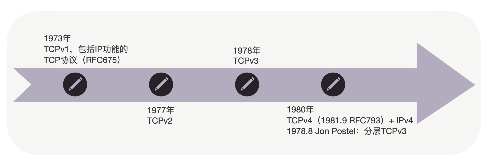
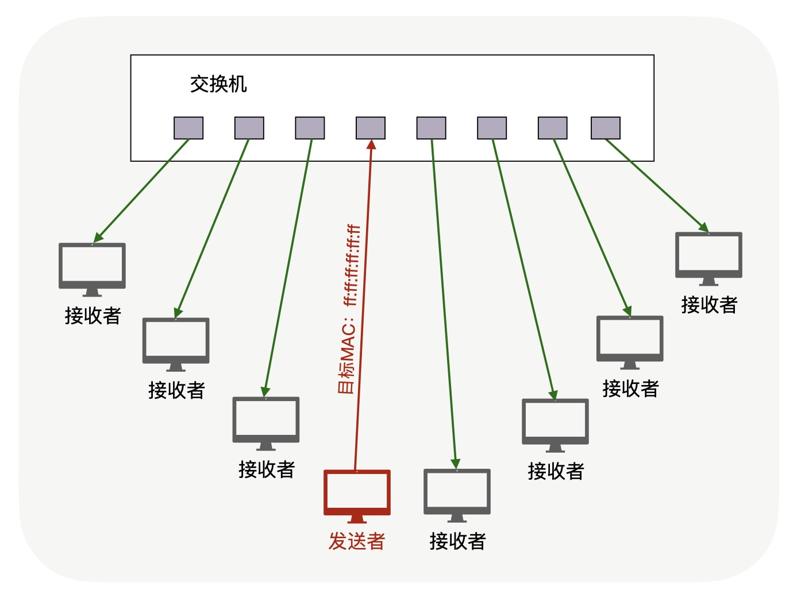
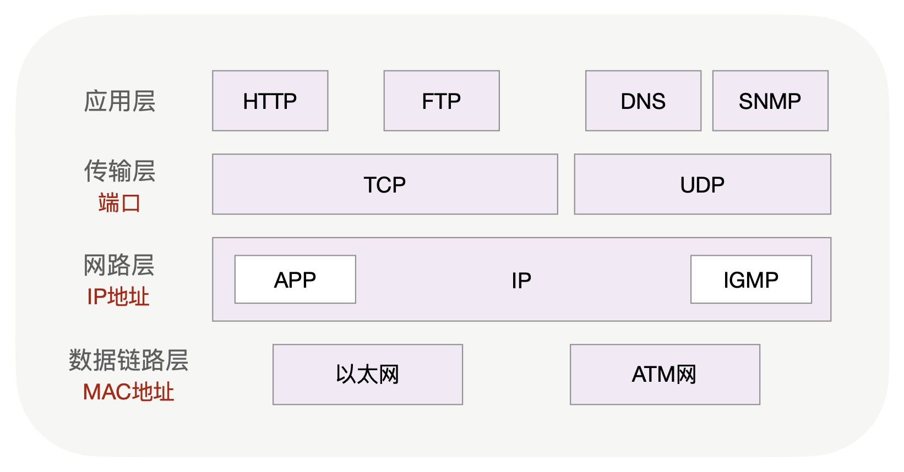
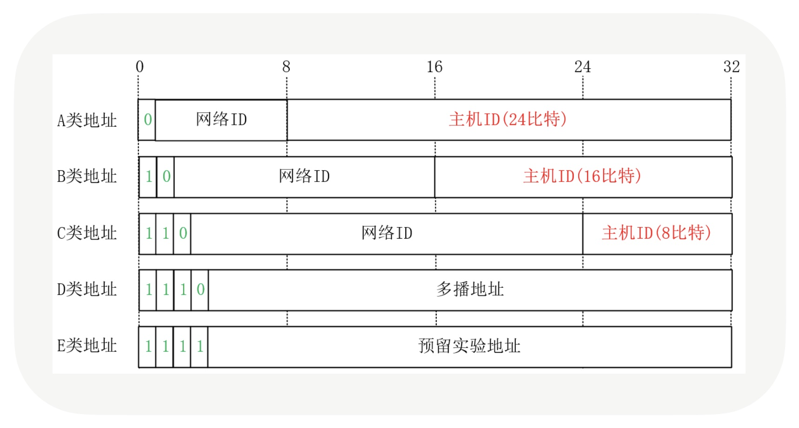
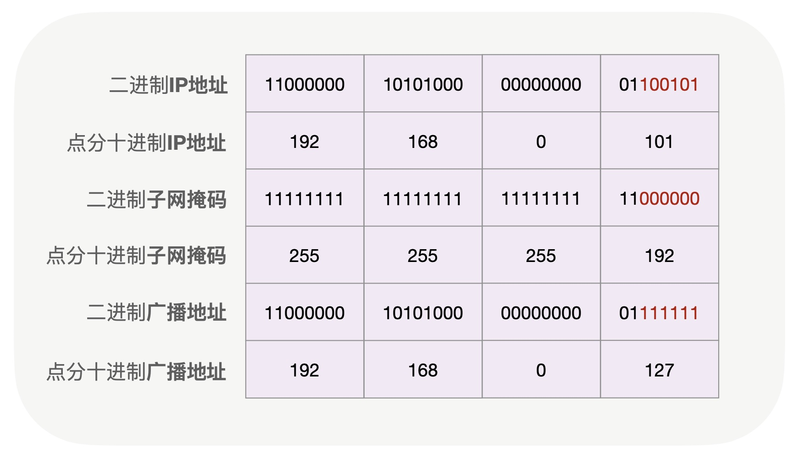
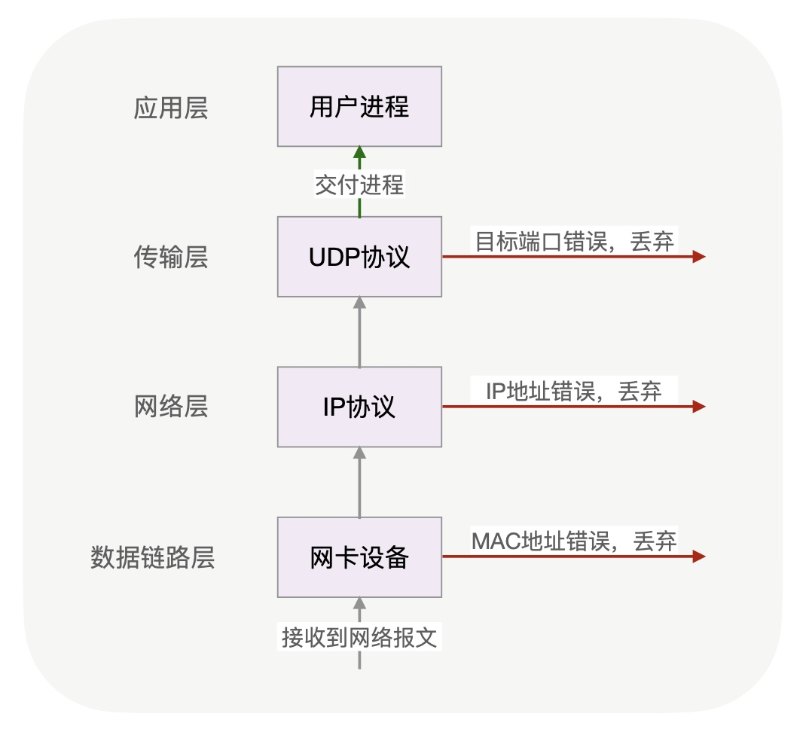

# 性能好，效率高的一对多通讯该如何实现？

我们接触过的绝大多数通讯方式，无论是面向连接的 HTTP 协议，还是无连接的 DNS 协议，都是一对一收发消息的。其实，除了一对一，还有一对多的通讯方式，它在网络资源的利用上效率要比一对一高得多。这种一对多的通讯方式，在局域网中有很广泛的应用，常见的 ARP 欺骗、泛洪攻击等，都是通过一对多通讯进行的。

当应用场景中用一对多代替一对一通讯时，发送方性能会获得很大的提升，整个局域网的效率也会提高。比如，源主机的带宽只有 1Gbps，如果采用一对一的方式向 100 个客户端发送流媒体，这 100 台主机的带宽之和不会超过 1Gbps。但采用一对多传输时，总带宽就可以达到 100Gbps。

除了能提升性能以外，由于一对多通讯可同时向所有主机发送消息，这就在功能层面上可以替换许多人工操作。比如分布式系统的服务发现，使用人工配置既容易出错，速度也慢，而用广播就可以轻松实现自动化服务发现。

一对多通讯协议一直在发展，在运营商的 IPTV 网络的视频直播中，它就得到了广泛的应用。即使你暂时不会用到一对多这种方式，也应当了解下它是怎么工作的，熟悉它的工作原理后，还能更深入地理解一对一通讯协议。

这一讲，我们就来学习如何实现一对多通讯。

## 广播是怎么实现的？

一对多通讯分为两种：对局域网内所有主机发送消息的叫做**广播**，而对部分主机发送消息的，则叫做**组播**。我们先来看一下广播是怎么实现的。

使用广播要改用 UDP 协议。可能你会问，为什么不能使用最熟悉的 TCP 协议呢？这要从 TCP 协议的分层说起。

1978 年在 TCP 协议迭代了 3 个版本后，才被 Jon Postel（IANA 创始人）提出违反了网络分层原则，网络层和传输层耦合在一起很难扩展。于是在 TCP 的第 4 个迭代版本中把协议一分为二，包括网络层 IP 协议和传输层 TCP 协议（这也是今天的 IP 协议被称为 IPv4 的原因）。

当你访问 Internet 站点时，IP 协议会将数据通过网络设备穿越多个卫星、光纤等网络，才能送到服务器。而网络设备天然就拥有广播能力，当它在一个网络端口上收到主机发来的报文时，可以向其他端口上的所有主机重发一遍，这就是广播，如下图所示：

**虽然 IP 协议已经具有广播功能，但实际编程中并不会直接使用 IP 协议发送广播，因为它很难与进程关联起来。**

根据网络分层模型，上层协议可以使用下层协议的功能，所以传输层协议拥有 IP 协议的广播能力。同时，传输层通过端口号把网络报文和进程关联在了一起，就像 TCP 的 80 端口，把 HTTP 消息与 Nginx 等 Web Server 关联在一起。

然而，传输层的 TCP 协议为了保证可靠性，建立了逻辑上的连接概念，由于一个连接上只能有两方，所以 TCP 无法进行一对多通讯。而传输层的 UDP 协议无需建立连接，所以我们常用 UDP 协议发送广播。

广播的性能高有两个原因：首先，交换机直接转发给接收方，要比从发送方到接收方的传输路径更短。其次，原本需要发送方复制多份报文再逐一发送至各个接受者的工作，被交换机完成了，这既分担了发送方的负载，也充分使用了整个网络的带宽。

那么，交换机收到消息后，怎么知道这是广播报文并转发给整个网络呢？我们知道，以太网中的数据链路层，通过硬件的 MAC 地址来传播消息，交换机就通过报文的 MAC 地址来确定是否需要广播。**当交换机收到目标 MAC 地址是 ff:ff:ff:ff:ff:ff 的报文时**，便知道这是一个广播报文，才会将它转发给局域网中的所有主机，否则只会转发给 MAC 地址对应端口上的主机。

不过，我们写代码时无法控制底层的 MAC 地址，只能填写目标 IP 地址。什么样的目标 IP 地址，会生成广播 MAC 地址呢？**如果只是对所在子网进行广播，那么使用受限广播地址 255.255.255.255 就可以了；如果局域网划分了多个子网，主机需要向其他子网广播，则需要正确地设置直接广播地址（路由器需要打开直接广播功能）。**

## 如何正确地设置直接广播 IP 地址？

怎么设置直接广播的 IP 地址呢？我们首先得了解 IP 地址的构成。

由于 IP 协议需要跨越多个网络工作，所以 IP 地址被一分为二，包括前边的网络 ID 和后边的主机 ID，其中，**网络 ID 用于不同网络间的寻址，而主机 ID 则用于在本地局域网内通讯。**

举个例子，如果你的局域网 IP 地址是 192.168.0.101，那么网络 ID 就是 192.168.0，而主机 ID 则是 101（这里假定网络管理员没有继续划分 C 类子网）。

这是因为，以 192.168 打头的 IP 地址，被称为 C 类地址，而 C 类地址中，最后 1 个十进制数字代表主机 ID。如果 IP 地址是 172.16.20.227，这就是 B 类地址，此时，172.16 是网络 ID，而 20.227 才是主机 ID。

所以，IP 地址的前缀数字不同，主机 ID 的划分位置也不同。事实上，IP 地址一共被划分为 A、B、C、D、E，5 个类别，它的划分依据正是 IP 地址转换为二进制后，用前 4 个比特位作为依据的。如果第 1 个比特位为 0，这就是 A 类地址，它的网络 ID 是 IP 地址的第 1 到第 8 比特位，而主机 ID 则是随后的 24 个比特位。如果局域网 IP 地址第 1 个数字是 10，这就是 A 类私有地址（局域网中的地址不能在公网中使用，统称为私有地址或者内网地址）。

类似的，若前 2 个比特位是 10，则是 B 类地址，它的主机 ID 是后 16 位；如果前 3 个比特位为 110，这就是 C 类地址，它的主机 ID 是后 8 位。显然，以 192 打头的地址，前 3 位正是 110，所以这是 C 类地址。

此外还有 D 类组播地址和 E 类预留实验地址。

清楚了划分方法后，再来看如何通过修改主机 ID 将 IP 地址改为直接广播地址。如果你留心观察 IP 地址，会发现主机 ID 不会出现全 0 和全 1 这两种情况，这是因为全 0 和全 1 有特殊用途，其中全 0 特指它自己（所以 0.0.0.0 可以指代本机 IP），而全 1 表示全部主机。

**所以，主机 ID 的比特位全部设为 1 后就是广播地址。**比如，192.168.0.101 是 C 类地址，把主机 ID 从 101 改为 255 后，就可以用 192.168.0.255 发送广播了。

然而，事情到这并没有完。一个 A 类网络可以容纳千万台主机，B 类网络则只能容纳 6 万多台主机，C 类网络则最多容纳 254 台主机。仅有的三类网络中主机数量差距太大，而世界上存在各种规模的企业，它们所需网络中的主机规模千差万别，上述划分方式太过单一，无法满足各类企业的需求，**于是诞生了 CIDR 这种新的划分方式，它通过子网掩码（或者叫 Netmask），可以在任意的位置将 IP 地址拆分为网络 ID 和主机 ID，扩展了 A、B、C 三类网络的用法。**

当你查看主机的 IP 地址时，就会看到其后跟着一个类似 IP 地址的子网掩码。子网掩码必须把它展开成二进制才能使用，这样，掩码前 N 位为 1 时，就表示 IP 地址的前 N 位是网络 ID，而掩码后面剩余的位全是 0，表示 IP 地址对应的位是主机 ID。

比如，若 192.168.0.101 的子网掩码是 255.255.255.192，就表示 IP 地址的前 26 位是网络 ID，后 6 位是主机 ID，将主机 ID 置为全 1 后，就得到了它的广播地址 192.168.0.127，如下图所示：

到这里，我们设置好 IP 地址后，再把 socket 句柄设置 SO_BROADCAST 属性，就可以发送广播了。广播虽然有很多优点，可是一旦被滥用，很容易产生网络风暴，所以路由器默认是不转发广播报文的。

## 用更精准的组播来做服务发现

当你用 UDP 广播来做分布式系统的服务发现，会遇到这样一个问题：若并非网络内的所有主机都属于分布式系统，那么，当指定了端口的 UDP 广播报文到达其他主机时，会怎么样呢？这些广播报文在这 3 个步骤后会被丢弃：

- 第 1 步，网卡设备收到报文后，查看报文中的目标 MAC 地址是否与本机的 MAC 地址匹配，如果不匹配就会丢弃。广播 MAC 地址默认匹配，继续交由上层的 IP 协议栈处理；
- 第 2 步，IP 协议栈查看目标 IP 地址是否为本机 IP 地址，不匹配也会丢弃报文。上文介绍过的广播 IP 地址同样默认匹配，交由传输层协议继续处理。
- 第 3 步，传输层检查目标端口是否有进程在监听，如果没有则丢弃报文，反之则交付给进程处理。不属于集群的主机自然不会启动服务监听端口，在这一步才会丢弃广播报文。

可见，对于不属于分布式集群的主机而言，广播报文既占用了它们的带宽，这 3 步协议栈的操作也消耗了 CPU 的计算力。有什么办法能缩小广播的范围，消除它加在无关主机上的负载呢？

组播可以做到。组播是一种“定向广播”，它设定了一个虚拟组，用组播 IP 来标识。这个虚拟组中可以包含多个主机的 IP，当向对应的组播 IP 发送消息时，仅在这个组内的主机才能收到消息。

组播 IP 与常见的单播 IP 不同，它是前文介绍过 5 类 IP 地址中的 D 类地址，32 位 IP 地址的前 4 位必须是 1110，因此组播 IP 地址的范围是从 224.0.0.0 到 239.255.255.255。

当设置好组播 IP 地址后，还要通过管理组播地址的 IGMP 协议（Internet Group Management Protocol），将主机 IP 地址添加进虚拟组中。编程语言提供的 setsockopt 函数，就可以操作 IGMP 协议管理组播地址。比如，使用参数 IP_ADD_MEMBERSHIP 就能够向虚拟组中增加 IP，而 IP_DROP_MEMBERSHIP 则可以从组中去除某个主机的 IP。

[这里](https://github.com/russelltao/geektime-webprotocol/tree/master/python%E7%A4%BA%E4%BE%8B%E4%BB%A3%E7%A0%81)有一个可运行的 python 测试代码，供你参考。如果你想进一步了解组播的细节，可以观看《Web 协议详解与抓包实战》第 117 课。

组播相对于广播而言 ，除了能够更精准的管理组播范围，还能够跨越多个网络工作。当然，如果将多个网络中的 IP 加入同一虚拟组时，需要涉及到的路由器都可以正确地处理这些 IP 地址，且都能支持 IGMP 协议。

## 小结

由于一对多通讯能够充分利用整体网络的性能，而且通过交换机能够同时向许多主机发送消息，所以在局域网内有广泛的应用。

在 TCP 协议分层后，IP 协议天然就支持一对多通讯方式。TCP 协议面向连接的特性使它放弃了一对多的通讯方式，而 UDP 协议则继承了 IP 协议的这一功能。所以，在一对多通讯场景中，我们会选择 UDP 协议。

正确输入广播地址的前提，是理解 IP 地址如何划分为网络 ID 和主机 ID。当主机 ID 所有的比特位改为全 1 时，IP 地址就表示该网络下的所有主机，这就是广播地址。当向广播地址发送 UDP 消息时，网络中的所有主机都会收到。广播在局域网中有广泛的应用，转换 IP 地址与 MAC 地址的 ARP 协议就是用广播实现的。

广播对无关的主机增加了不必要的负担，而组播可以更精准地“定向”广播。组播地址也被称为 D 类地址，它描述的虚拟组要通过 IGMP 协议管理。网络 API 中的 setsockopt 函数可以通过 IGMP 协议，向虚拟组中添加或者删除 IP 地址。当路由器支持 IGMP 协议时，组播就可以跨越多个网络实现更广泛的一对多通讯。

广播和组播能够充分地使用全网带宽，也通过交换机等网络设备分散了发送主机的负载。但它很难对每台接收主机提供定制化服务，这样可靠传输就很难实现。这使得它们在更关注及时性、对丢包不敏感的流媒体直播中更有应用前景。

这一讲我们介绍了许多网络概念，这些也是理解后续内容的基础。从下一讲开始，我们将进入更复杂的一对一通讯协议。

## 思考题

你使用或者了解过哪些一对多的通讯协议？它们的优缺点，以及未来的发展方向又是什么？